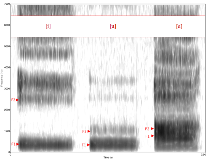
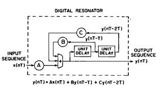
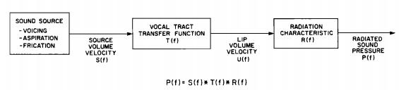

## Introduction
Synthesizers mainly fall into the following categories:
+ Articulary Synthesizer

 This type of synthesizer tries to model the real mechanics of articulary system. By studing the structure of human voice bio-system, the synthesizer derives appropriate mathematical model and simulate human voice 

+ Concatenative Synthesizer

Suppose we have a corpus(a database consists of speech unit records), this type of synthesis applies grammar and statistical techniques to cocncatenate speech pieces. And then generate audible output.

+ HMM/DL Synthesizer

Most popular and natural synthesizer. Applied machine learning and deep learning to model speech in both frequency domain and time domain. By learning tons of data, this can generate the best quality speech so far (breakthrough: wavenet, google Deepmind for details)

These days the "hardcore" synthesizer is no longer popular, people are crowding in from ML/DL to run learning all over the place. Still it is meaningful to know how they try to model human voice system and learn the acoustic model behind the scene. This small article will introduce such synthesizer called formant synthesizer.

## Theory
#### What is formant
A formant, is a harmonic of a note that is augmented by a resonance.
My understanding? Formant is the area with high energy density in the frequency spectrum. It does not describe all the information contained in the speech, but it captures the most significant physical natures of the speech. (peak in the energy spectrum)

#### Why Formant?
It provides a simple way to approxiamate speech waveform. Additionally, it is easy to compute and can provide suffcient precision compared to the real speech.

#### Model of Formant
View the vocal cord as a resonator, the sound souce will keep vibrating in the 'resonate chamber'. It is nature to build such digital resonator with 

  $$ y(nT) = Ax(nT) + By(nT-T) + Cy(nT-2T) $$ 
It is easy to calculate that $C = -exp(-2\pi B W T)$,$B = 2exp(\pi B W T)$,$A = 1-A-B$
## Implementation

The implementation is based on the classical paper of Klatt. The major steps are shown in the following figure

Details to be discussed in the next article.

## Source
Klatt, Dennis H. "Software for a cascade/parallel formant synthesizer." the Journal of the Acoustical Society of America 67.3 (1980): 971-995.