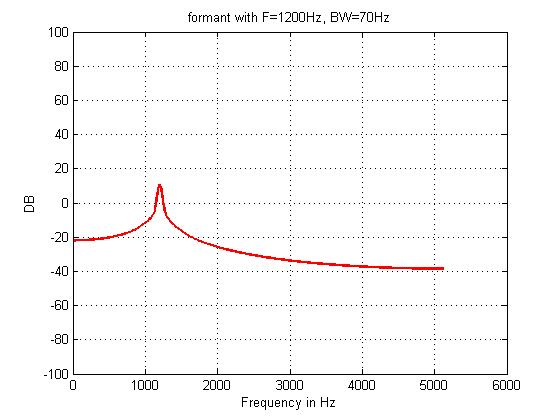
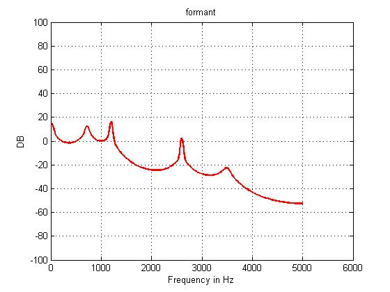

## Implementation

Continued from last article. First generate voice source by some basic signals, like buzz signals, white noise, pink noise, triangular wave etc. By experiment, buzz signal has better performance, which makes sense because it is close to human glottal impulses. Then let the voice source passes through a low-pass filter before going into formant filters. Finally add a filter to simulate the radiation characteristics.

Formant filters have two basic configurations: parrallel and cascade. The choice basically depends on audiable sound principle of the pronouciation.

A particular set of formant frequencies can characterize each vowel Different English vowels have distinct three lowest frequencies, which has been studied and can be easily obtained. Each formant resonator will introduct a peak in the manitude spectra. For a single piece of speech, formant frequencies will depend on the phoneitc segments. And usually three formants are enough to represent the spectrum of a single pronounciation.

Single formant spectrum

Formant filters transfer function for pronouciation [a]

There is a formant frequencies table for English vowels online, just google it for more info.

## Further details

+ Real speech will contain some kind of noise, which can be simulated by adding white(pick) noist to the signal (or to the spectrum).
+ Nasalization is important and cannot be neglected. That can be realized by adding additional anti-resonator RNZ.
+ Radiation filter is implemented as a simple high-pass filter in the paper. In reality, radiation is not that simple, and that characteristics can be imporved.

## Play with it
Really simple to implement with the filter function in Matlab. If you just want to play with it, check VOSIM synthesizer, it is amazing! 

[VOSIM paper](http://www.atiam.ircam.fr/wp-content/uploads/2011/12/AES_JAES_1978_Kaegi_VOSIM.pdf)

[VOSIM youtube](https://www.youtube.com/watch?v=eyjI_0o0zto)
(thats how you make robot-like electronic music!)

