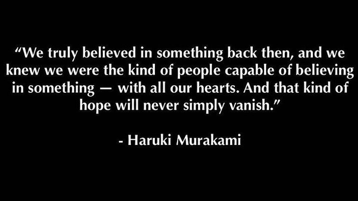

趁着书店打折，10刀入了两本， 一本送人了。

## 遗留的创伤

> “You can hide memories, but you can't erase the history that produced them.” 

很遗憾我们永远无法改变过去，在某些情况下，过去还会一直停留在我们的生活里。多绮作－与名字相反，在五人小组里面平凡不起眼的那个，仿佛无色透明的空气一般存在着。在毫无预兆的一天突然被遗弃了，没有解释只有语焉不详的敷衍。
这是他人生中最大的挫折与创伤，他觉得自己真的是没有色彩的人，空虚，没有内容，像一个零。经历了痛苦漫长的自我放逐与逃避现实，他好像慢慢的回到了正轨。过去仿佛清晨的雾气，已经慢慢散去，现在他已经成长为一个男人.

直到遇到Sara,一个他想认真相处的女朋友。他才发现伤痕一直都在，并没有随着时间抹去。Sara了解了发生过的事，说他被摧毁的不只是自我的认同，还有活力，欲望。只有去面对这些，他才有可能正常的生活。

书的结尾，留下了一个开放的结局。Sara也许像作之前的朋友那样，一声不响的消失了，也许她留了下来。不过这没关系，作已经找到了自我，他人并不构成“我”意义的全部。世界并没有抛弃你，只要你还找得到自己。

## Shadow Follows You
像多崎作一样，我们都是背负着过去的人。我们都是最普通的人，在多崎作身上看到了自己的影子。在黑暗中蜷缩的日子，对着天花板当镜子的自己。

> Don't let the bad elves get you!
并不像他们说的那样，很多事忍忍就过去了。说的太轻松了，很多时候人事差一点就过不去的。 
心灵深受创伤的时候，你并不会大喊，你是说不出来话的。
只有勇气能让你走出来，懦弱和自尊有时候反而会托你的后腿。如果想要成长，不要怕去揭伤口的疤。

## 快乐
仅仅因为缺乏勇气，我们已经遗憾的错过了一些人生体验（经验？）和幸福。

对生活不能失去信心。生活的磨难像海浪一样，一波接着一波永远不会消失。只有像礁石一样坚韧，才有可能不被打碎。

不要总是背着沉重的包袱前进，停下来，把背上的东西扔掉。 

