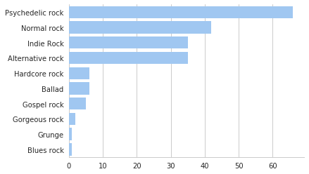

最近事比较多，死线逼迫着我。。。
非常的忙(lan), 不定期托更, 本着把事情做完的原则，还是把爬下来的落网数据慢慢分析完吧，用户数据和音乐数据一直存在一个数据库里没动。。

The post is a simple analysis of the music tags in [luoo.net](luoo.net), which, as the first step of the luoo analysis.

First of all, the data crawler is written in Python, which imports libraries like bs4 and request to obtain and parse data. Then store data in a sql database(not necessary, as data size is only a few Mb).

There are 943 music volumes in Luoo now, and most of them have multiple music tags. The tag plot is drawn by seaborn as shown below:

## Rock Music
Very popular music genre in Luoo site, post-rock is not counted in the stats(in my heart it's something way better)

